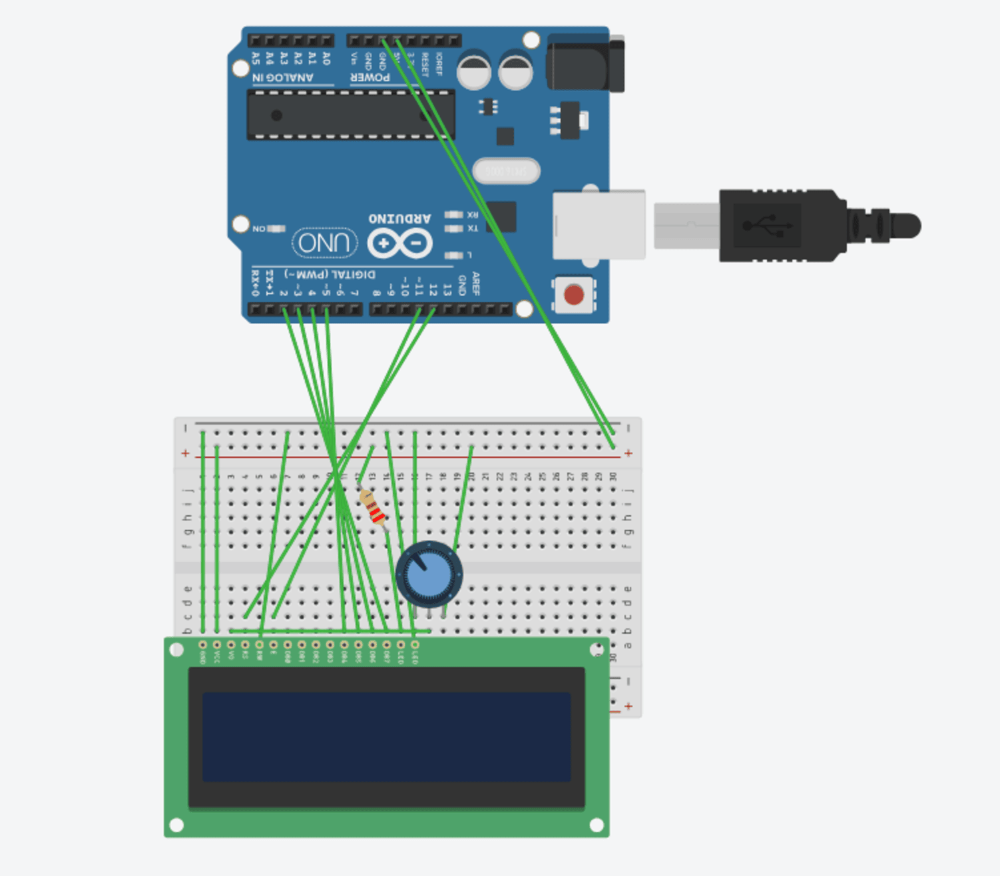

# Arduino TOTP Generator

## Overview:

Combining an Arduino UNO and Python's ``serial`` and ``pyotp`` libraries, this project is essentially a portable TOTP (time-based one-time password) generator. It generates a code with ``TOTP.py``, then sends that code to the Arduino, where it is displayed on the Arduino's LCD screen. A simple, CLI-based login utility is included, which allows you to test the TOTP and see how it relates to real-world authentication systems. 

## Setup Guide:

Setting up this project takes two parts: Software configuration, and Hardware configuration. 


### Hardware configuration:

The most interesting part of this project is the Arduino itself, and how it is wired. There are many wires, and a lot of them intersect, so be very careful and try not to lose track of where your wires end. You can refer to the diagram below, or follow the pin table.


You will need the following components:

- An Arduino Uno
- An LCD Display
- A breadboard
- Jumper wires
- A 220 ohm resistor
- A potentiometer (the ones included with an average Arduino starter kit may look different than the one in the diagram; that is normal and expected, just ensure that it is actually a potentiometer and not something else.)


| Arduino Pin | LCD Pin Name | LCD Pin # | Purpose |
| :--- | :--- | :--- | :--- |
| **GND** | VSS / LED- | 1 / 16 | Connects to the negative (-) power rail |
| **5V** | VDD / LED+ | 2 / 15 | Connects to the positive (+) power rail |
| **GND** | RW | 5 | Read/Write pin connects to Ground |
| **Digital 12** | RS | 4 | Register Select control line |
| **Digital 11** | E | 6 | Enable control line |
| **Digital 5** | D4 | 11 | Data bit 4 line |
| **Digital 4** | D5 | 12 | Data bit 5 line |
| **Digital 3** | D6 | 13 | Data bit 6 line |
| **Digital 2** | D7 | 14 | Data bit 7 line |
| **Analog / Pot** | V0 | 3 | Middle wiper pin of the potentiometer for contrast adjustment |





### Software configuration:

Once you have wired up your Arduino, you will then need to clone the repository and ``cd`` into it. The ``requirements.txt`` and the source code for the entire project, including the Python files and the mock login service, will be found inside.

To install the necessary Python libraries, run: ```pip install -r requirements.txt```.

To view the source code for the Arduino, open: [``TOTP_Generator.ino``](TOTP_Generator.ino).

To view the Python source code for the TOTP Generator, open: [``TOTP.py``](TOTP.py). Do note that in line 10 of the code, reproduced here: 

``arduino = serial.Serial(port='COM6', baudrate=9600, timeout=1)``

The port is set to ``COM6``. You will need to change this according to the port that your Arduino connects to on your computer.

To view the Python source code for the included mock login utility, open: [``login.py``](login.py).


### Running the project:

To run the project, first plug in your Arduino to your computer, open your Arduino IDE, then open the ``.ino`` file, and upload it to your Arduino.

Next, open any code editor of your choice and run the ``TOTP.py`` file.

You should see the TOTP code display on your screen. A new one will generate every 30 seconds. To test the code's functionality, open a separate terminal and run ``login.py``. Enter the current code when prompted and have fun.

If you think of ways to expand this project, do feel free to let me know. I may update this with time, as new ideas come to me. 
